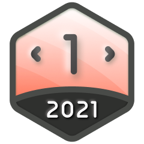
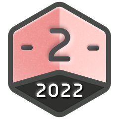
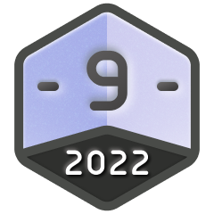

# 🏆 LeetCode Badges 🏆

### This repository aims to compile an exhaustive list of LeetCode.com badges.

## Competition Medals

  
| Guardian | Knight |
|----------|--------|
| =1600 and finish in the top 5% of a contest"> | =1600 and finish in the top 25% of a contest"> |

## Submission Days

| 2000 Days Badge | 1000 Days Badge | 500 Days Badge | 365 Days Badge |
|----------------|----------------|---------------|---------------|
|  |  |  |  |

## Annual Medals

<table>
  <tr>
    <th>2021</th>
    <th>2022</th>
    <th>2023</th>
    <th>2024</th>
    <th>2025</th>
  </tr>
  
  <tr>
    <th colspan="5" align="center">Annual Badge (300+ Days)</th>
  </tr>
  <tr>
    <td align="center"></td>
    <td align="center"></td>
    <td align="center"></td>
    <td align="center"></td>
    <td align="center"></td>
  </tr>
  
  <tr>
    <th colspan="5" align="center">50 Days Badge</th>
  </tr>
  <tr>
    <td align="center"></td>
    <td align="center"></td>
    <td align="center"></td>
    <td align="center"></td>
    <td align="center"></td>
  </tr>

  <tr>
    <th colspan="5" align="center">100 Days Badge</th>
  </tr>
  <tr>
    <td align="center"></td>
    <td align="center"></td>
    <td align="center"></td>
    <td align="center"></td>
    <td align="center"></td>
  </tr>

  <tr>
    <th colspan="5" align="center">200 Days Badge</th>
  </tr>
  <tr>
    <td align="center"></td>
    <td align="center"></td>
    <td align="center"></td>
    <td align="center"></td>
    <td align="center"></td>
  </tr>
</table>

## 🏅 Daily Medals 🏅

<table>
  <tr>
    <th colspan="5" align="center">January</th>
  </tr>
  <tr>
    <td align="center"></td>
    <td align="center"></td>
    <td align="center"></td>
    <td align="center"></td>
    <td align="center"></td>
  </tr>

  <tr>
    <th colspan="5" align="center">February</th>
  </tr>
  <tr>
    <td align="center"></td>
    <td align="center"></td>
    <td align="center"></td>
    <td align="center"></td>
    <td align="center"></td>
  </tr>

  <tr>
    <th colspan="5" align="center">March</th>
  </tr>
  <tr>
    <td align="center"></td>
    <td align="center"></td>
    <td align="center"></td>
    <td align="center"></td>
    <td align="center"></td>
  </tr>

  <tr>
    <th colspan="5" align="center">April</th>
  </tr>
  <tr>
    <td align="center"></td>
    <td align="center"></td>
    <td align="center"></td>
    <td align="center"></td>
    <td align="center"></td>
  </tr>

  <tr>
    <th colspan="5" align="center">May</th>
  </tr>
  <tr>
    <td align="center"></td>
    <td align="center"></td>
    <td align="center"></td>
    <td align="center"></td>
    <td align="center"></td>
  </tr>

  <tr>
    <th colspan="5" align="center">June</th>
  </tr>
  <tr>
    <td align="center"></td>
    <td align="center"></td>
    <td align="center"></td>
    <td align="center"></td>
    <td align="center"></td>
  </tr>

  <tr>
    <th colspan="5" align="center">July</th>
  </tr>
  <tr>
    <td align="center"></td>
    <td align="center"></td>
    <td align="center"></td>
    <td align="center"></td>
    <td align="center"></td>
  </tr>

  <tr>
    <th colspan="5" align="center">August</th>
  </tr>
  <tr>
    <td align="center"></td>
    <td align="center"></td>
    <td align="center"></td>
    <td align="center"></td>
    <td align="center"></td>
  </tr>

  <tr>
    <th colspan="5" align="center">September</th>
  </tr>
  <tr>
    <td align="center"></td>
    <td align="center"></td>
    <td align="center"></td>
    <td align="center"></td>
    <td align="center"></td>
  </tr>

  <tr>
    <th colspan="5" align="center">October</th>
  </tr>
  <tr>
    <td align="center"></td>
    <td align="center"></td>
    <td align="center"></td>
    <td align="center"></td>
    <td align="center"></td>
  </tr>

  <tr>
    <th colspan="5" align="center">November</th>
  </tr>
  <tr>
    <td align="center"></td>
    <td align="center"></td>
    <td align="center"></td>
    <td align="center"></td>
    <td align="center"></td>
  </tr>
  
  <tr>
    <th colspan="5" align="center">December</th>
  </tr>
  <tr>
    <td align="center"></td>
    <td align="center"></td>
    <td align="center"></td>
    <td align="center"></td>
    <td align="center"></td>
  </tr>
</table>
