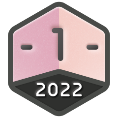
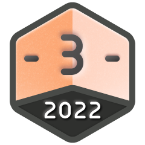
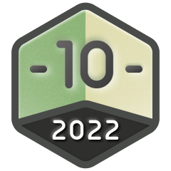
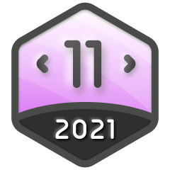
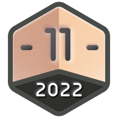
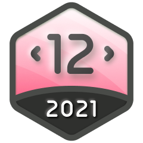

<h3 align="center">An Exhaustive Compilation of all LeetCode Badges</h3>
 

## Contest Medals

| Guardian | Knight |
|----------|--------|
| =1600 and finish in the top 5% of a contest"> | =1600 and finish in the top 25% of a contest"> |

## Code Submission Medals

| 2000 Days Badge | 1000 Days Badge | 500 Days Badge | 365 Days Badge |
|----------------|----------------|---------------|---------------|
|  |  |  |  |

## Annual Medals

<table align=center>
  <tr>
    <th>2021</th>
    <th>2022</th>
    <th>2023</th>
    <th>2024</th>
    <th>2025</th>
  </tr>

  <tr>
    <th colspan="5" align="center">Annual Badge (300+ Days)</th>
  </tr>
  <tr>
    <td align="center"></td>
    <td align="center"></td>
    <td align="center"></td>
    <td align="center"></td>
    <td align="center"></td></td>
  </tr>

  <tr>
    <th colspan="5" align="center">50 Days Badge</th>
  </tr>
  <tr>
    <td align="center"></td>
    <td align="center"></td>
    <td align="center"></td>
    <td align="center"></td>
    <td align="center"></td>
  </tr>

  <tr>
    <th colspan="5" align="center">100 Days Badge</th>
  </tr>
  <tr>
    <td align="center"></td>
    <td align="center"></td>
    <td align="center"></td>
    <td align="center"></td>
    <td align="center"></td>
  </tr>

  <tr>
    <th colspan="5" align="center">200 Days Badge</th>
  </tr>
  <tr>
    <td align="center"></td>
    <td align="center"></td>
    <td align="center"></td>
    <td align="center"></td>
    <td align="center"></td>
  </tr>
</table>

## Monthly Medals

<table align=center>
  <tr>
    <th colspan="5" align="center">January</th>
  </tr>
  <tr>
    <td align="center"></td>
    <td align="center"></td>
    <td align="center"></td>
    <td align="center"></td>
    <td align="center"></td>
  </tr>

  <tr>
    <th colspan="5" align="center">February</th>
  </tr>
  <tr>
    <td align="center"></td>
    <td align="center"></td>
    <td align="center"></td>
    <td align="center"></td>
    <td align="center"></td>
  </tr>

  <tr>
    <th colspan="5" align="center">March</th>
  </tr>
  <tr>
    <td align="center"></td>
    <td align="center"></td>
    <td align="center"></td>
    <td align="center"></td>
    <td align="center"></td>
  </tr>

  <tr>
    <th colspan="5" align="center">April</th>
  </tr>
  <tr>
    <td align="center"></td>
    <td align="center"></td>
    <td align="center"></td>
    <td align="center"></td>
    <td align="center"></td>
  </tr>

  <tr>
    <th colspan="5" align="center">May</th>
  </tr>
  <tr>
    <td align="center"></td>
    <td align="center"></td>
    <td align="center"></td>
    <td align="center"></td>
    <td align="center"></td>
  </tr>

  <tr>
    <th colspan="5" align="center">June</th>
  </tr>
  <tr>
    <td align="center"></td>
    <td align="center"></td>
    <td align="center"></td>
    <td align="center"></td>
    <td align="center"></td>
  </tr>

  <tr>
    <th colspan="5" align="center">July</th>
  </tr>
  <tr>
    <td align="center"></td>
    <td align="center"></td>
    <td align="center"></td>
    <td align="center"></td>
    <td align="center"></td>
  </tr>

  <tr>
    <th colspan="5" align="center">August</th>
  </tr>
  <tr>
    <td align="center"></td>
    <td align="center"></td>
    <td align="center"></td>
    <td align="center"></td>
    <td align="center"></td>
  </tr>

  <tr>
    <th colspan="5" align="center">September</th>
  </tr>
  <tr>
    <td align="center"></td>
    <td align="center"></td>
    <td align="center"></td>
    <td align="center"></td>
    <td align="center"></td>
  </tr>

  <tr>
    <th colspan="5" align="center">October</th>
  </tr>
  <tr>
    <td align="center"></td>
    <td align="center"></td>
    <td align="center"></td>
    <td align="center"></td>
    <td align="center"></td>
  </tr>

  <tr>
    <th colspan="5" align="center">November</th>
  </tr>
  <tr>
    <td align="center"></td>
    <td align="center"></td>
    <td align="center"></td>
    <td align="center"></td>
    <td align="center"></td>
  </tr>

  <tr>
    <th colspan="5" align="center">December</th>
  </tr>
  <tr>
    <td align="center"></td>
    <td align="center"></td>
    <td align="center"></td>
    <td align="center"></td>
    <td align="center"></td>
  </tr>
</table>

## Study Plan Medals

### Earnable

<table align=center>
  <tr>
    <td align="center"></td>
    <td align="center"></td>
    <td align="center"></td>
    <td align="center"></td>
    <td align="center"></td>
  </tr>
  <tr>
    <td align="center">Introduction to Pandas</td>
    <td align="center">30 Days of JavaScript</td>
    <td align="center">30 Days of Pandas</td>
    <td align="center">Top SQL 50</td>
    <td align="center">Premium SQL 50</td>
  </tr>

  <tr>
    <td align="center"></td>
    <td align="center"></td>
    <td align="center"></td>
    <td align="center"></td>
    <td align="center"></td>
  </tr>
  <tr>
    <td align="center">Programming Skills</td>
    <td align="center">Binary Search</td>
    <td align="center">Dynamic Programming</td>
    <td align="center">DP Grandmaster</td>
    <td align="center">Graph Theory</td>
  </tr>

  <tr>
    <td align="center"></td>
    <td align="center"></td>
    <td align="center"></td>
    <td align="center"></td>
    <td></td>
  </tr>
  <tr>
    <td align="center">Premium Algo 100</td>
    <td align="center">LeetCode 75</td>
    <td align="center">Top Interview 150</td>
    <td align="center">Top 100 Liked</td>
    <td></td>
  </tr>

</table>

### Removed

<table align=center>
  <tr>
    <td align="center"></td>
    <td align="center"></td>
    <td align="center"></td>
    <td align="center"></td>
    <td align="center"></td>
    <td align="center"></td>
  </tr>
  <tr>
    <td align="center">Algorithm I</td>
    <td align="center">Algorithm II</td>
    <td align="center">Algorithm III</td>
    <td align="center">Binary Search I</td>
    <td align="center">Binary Search II</td>
    <td align="center">Binary Search III</td>
  </tr>

  <tr>
    <td align="center"></td>
    <td align="center"></td>
    <td align="center"></td>
    <td align="center"></td>
    <td align="center"></td>
    <td align="center"></td>
  </tr>
  <tr>
    <td align="center">Data Structure I</td>
    <td align="center">Data Structure II</td>
    <td align="center">Data Structure III</td>
    <td align="center">SQL I</td>
    <td align="center">SQL II</td>
    <td align="center">SQL III</td>
  </tr>

  <tr>
    <td align="center"></td>
    <td align="center"></td>
    <td align="center"></td>
    <td align="center"></td>
    <td align="center"></td>
    <td align="center"></td>
  </tr>
  <tr>
    <td align="center">Prog. Skills I</td>
    <td align="center">Prog. Skills II</td>
    <td align="center">Prog. Skills II</td>
    <td align="center">Level 1</td>
    <td align="center">Level 2</td>
    <td align="center">Level 3</td>
  </tr>

  <tr>
    <td></td>
    <td align="center"></td>
    <td align="center"></td>
    <td align="center"></td>
    <td align="center"></td>
    <td></td>
  </tr>
  <tr>
    <td></td>
    <td align="center">Graph Theory I</td>
    <td align="center">Graph Theory II</td>
    <td align="center">DP I</td>
    <td align="center">DP II</td>
    <td></td>
  </tr>
</table>
